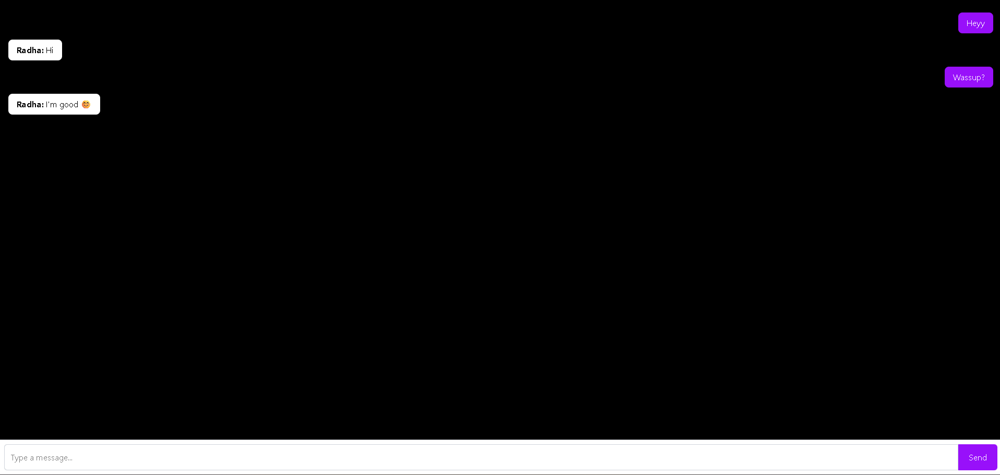

# Real-Time Chat Application

A real-time messaging application built with **React.js, Node.js, and WebSockets**.  
Supports **user authentication**, **live one-to-one communication**, and is deployed with **frontend on Vercel** and **backend on Render**.  

🔗 Live Demo → [Chat App](https://chatapp-sable-mu.vercel.app/)

---

## 🛠 Tech Stack
- **Frontend:** React.js, TypeScript, TailwindCSS  
- **Backend:** Node.js, Express.js, WebSockets (Socket.io)  
- **Authentication:** JWT  
- **Deployment:** Vercel (frontend), Render (backend)

---

## 📁 Project Structure
Chat-App/
├─ client/ # React frontend

├─ server/ # Express + WebSocket backend

├─ screenshots/ # Project screenshots for README

└─ README.md

---

## ⚙️ Setup

### 1) Clone the repository
``bash
git clone https://github.com/devanshjhaa/chat.git
cd chat

Install Dependencies:
# Frontend
cd client
npm install

# Backend
cd ../server
npm install

Environment Variables:

server/.env

PORT=8080

JWT_SECRET=replace_me

Run Locally:
# Backend
cd server
npm run dev

# Frontend (new terminal)
cd ../client
npm run dev

🚀 Features

Real-time messaging using WebSockets (Socket.io)

User authentication with JWT

Secure login/signup flow

Lightweight and responsive UI

Deployed on Vercel (frontend) and Render (backend)

## 📸 Screenshots

### Login  

### Chat Room  

